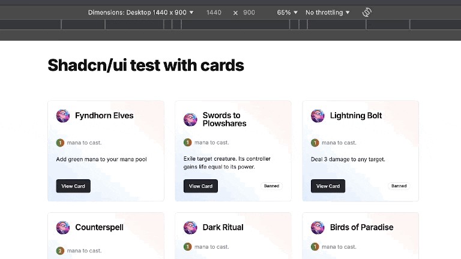

# Responsive card grid

- Built with Next.js using the Shadcn/ui Card component

- Displays trading card data from JSON mock api

- Custom Tailwind styling applied to cards



## How to use

Run the development server.
Open [http://localhost:3000](http://localhost:3000) with your browser to see the result.

```bash
npm run dev
```

Run the mock JSON api watching db.json file

```bash
json-server --watch ./_data/db.json --port 4000
```

Also works with a remote mock JSON API which can be deployed to Vercel

[JSON mock server on Vercel docs](https://github.com/kitloong/json-server-vercel)
